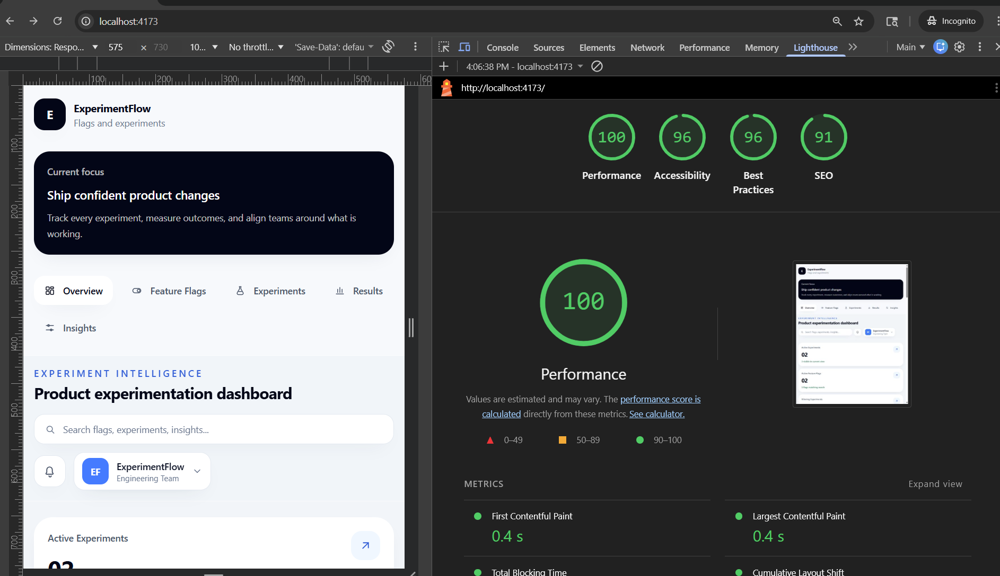
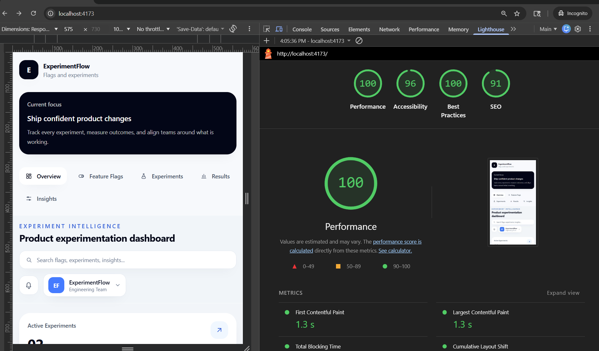

# ExperimentFlow Dashboard

A modern frontend-only SaaS dashboard built with React, TypeScript, Tailwind CSS, and Vite for visualizing feature flags and A/B experiments.

This project is designed around a realistic product workflow: helping engineering, product, and growth teams understand which experiments are live, which feature flags are enabled, what version is winning, and what action the team should take next.

## Overview

ExperimentFlow brings together:

- Feature flag controls
- Experiment monitoring
- Side-by-side variant comparisons
- Result summaries with confidence indicators
- Product insight reasoning
- Search and section-based navigation

The app uses static typed mock data and local React state, so it behaves like a real dashboard without requiring a backend.

## Demo Features

- Responsive dashboard layout with sidebar and top navigation
- Derived overview cards based on live dashboard data
- Search that filters both feature flags and experiments by name
- Interactive feature flag toggles using React state
- Feature-flag-driven UI behavior
- Experiment cards with:
  - status
  - owner/team tag
  - traffic split
  - last updated timestamp
  - version A vs version B comparison
- Results cards with:
  - conversion rate
  - drop-off rate
  - confidence level
  - winning version highlight
- Insight section with product-oriented explanations instead of raw metrics

## Tech Stack

- React 19
- TypeScript
- Tailwind CSS
- Vite
- PostCSS

## Performance

Production build Lighthouse results:

- Desktop Performance: 90+
- Mobile Performance: 90+




## Why This Project

Experimentation dashboards are a strong frontend challenge because they combine:

- structured data modeling
- reusable component design
- derived UI state
- product thinking
- accessibility
- performance optimization

This project was built to demonstrate more than styling. It shows how to turn raw product data into a decision-making interface.

## Project Structure

```text
src/
  components/
    AppLayout.tsx
    ExperimentCard.tsx
    FeatureFlagItem.tsx
    Icons.tsx
    OverviewCard.tsx
    ResultCard.tsx
    SectionHeader.tsx
    Sidebar.tsx
  data/
    mockData.ts
  pages/
    DashboardPage.tsx
  types/
    dashboard.ts
  utils/
    experimentDisplay.ts
  App.tsx
  index.css
  main.tsx
```

## Getting Started

### 1. Install dependencies

```bash
npm install
```

### 2. Start the development server

```bash
npm run dev
```

### 3. Build for production

```bash
npm run build
```

### 4. Preview the production build

```bash
npm run preview
```

## How It Works

The app keeps runtime state intentionally small:

- `flags`
- `searchQuery`

Everything else is derived from that source of truth, including:

- visible experiments
- filtered feature flags
- filtered experiment list
- overview metric cards

This keeps the state model simple, predictable, and easier to scale.

### Example

The `Fast Approval UI` feature flag is linked to the `Approval Flow Simplification` experiment. When the flag is toggled off, that experiment disappears from:

- the Experiments section
- the Results section
- the Insights section

This models a realistic product relationship between rollout controls and experiment visibility.

## Key Product Scenarios Modeled

### Feature Flags

Example flags included:

- New Checkout Flow
- Discount Banner
- Fast Approval UI

### Experiments

Included experiments:

- Checkout Optimization
- Activation Journey
- Approval Flow Simplification

Each experiment includes:

- Version A and Version B
- conversion rate
- drop-off rate
- status
- owner
- confidence level
- relative last updated timestamp
- product-oriented insight summary

## Reusable Component Design

The dashboard was built with reusable presentation components so data and layout remain easy to evolve.

Examples:

- `OverviewCard` for KPI summaries
- `FeatureFlagItem` for local toggle behavior
- `ExperimentCard` for experiment comparison
- `ResultCard` for metrics and winning-state presentation
- `SectionHeader` for consistent section titles and descriptions

## Performance Optimizations

This project was later optimized to improve Lighthouse scores on both desktop and mobile.

### What was optimized

- Removed the external Google Fonts request and switched to a system font stack
- Replaced a larger icon dependency with local SVG icon components
- Reduced expensive paint effects such as heavier shadows and blur usage
- Deferred below-the-fold rendering with `content-visibility`
- Kept React state minimal and derived secondary UI state with `useMemo`

### Why that matters

These improvements help reduce:

- first render cost
- network requests
- bundle overhead
- paint and layout work on mobile devices

## Accessibility Improvements

The app also includes accessibility-focused improvements:

- skip link for keyboard users
- semantic landmarks
- labeled navigation
- labeled search field
- `aria` support for toggle switches
- better focus-visible states
- improved heading/section relationships
- stronger text contrast in key UI areas

## Example Interview Talking Points

If you are using this project in interviews, these are good points to mention:

- I used TypeScript to make the experiment, flag, and results data model explicit and safer to refactor.
- I avoided overengineering state management by storing only essential UI state and deriving the rest.
- I treated product behavior as part of the frontend, not just visual output.
- I improved both bundle cost and render cost when optimizing Lighthouse performance.
- I improved accessibility through semantics, focus management, labeling, and contrast rather than treating it as a checklist item.

## Future Enhancements

This project is frontend-only today, but it can scale naturally with more product functionality.

Possible next steps:

- API integration for live experiments and flag data
- persistent feature flag state
- authentication and role-based access
- charts and historical performance trends
- optimistic updates for toggles
- experiment detail pages
- filtering by owner, status, or confidence
- route-based dashboard modules
- server-state management with React Query
- virtualization for large experiment datasets

## Portfolio Summary

ExperimentFlow is a polished React dashboard project that demonstrates:

- component architecture
- state modeling
- TypeScript usage
- product-oriented UI thinking
- performance optimization
- accessibility improvements
- responsive frontend engineering

## License

This project is available for personal learning, portfolio use, and demonstration purposes.
